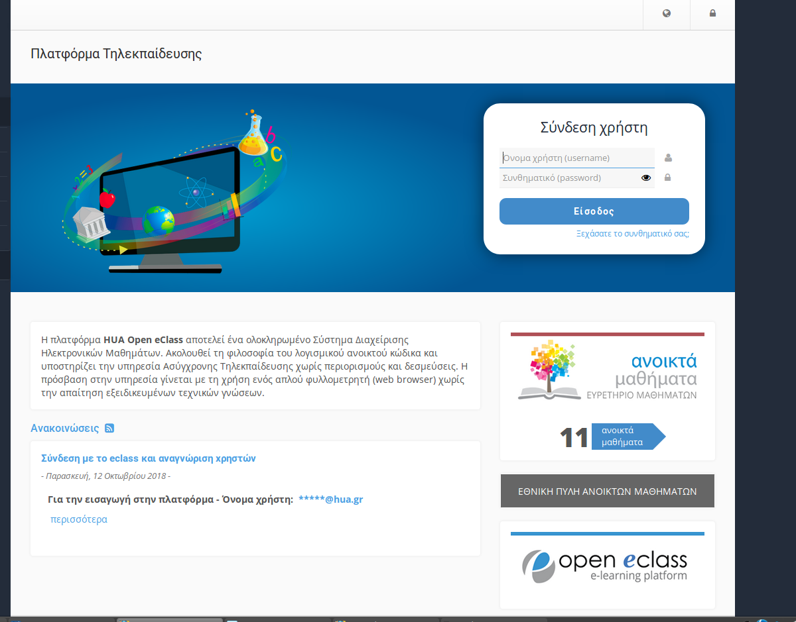

#Πρόταση για κοινό login

Θα μπορούσαμε να έχουμε ένα κοινό Login για όλους τους χρήστες και να διαχωρίζουμε τη συμπεριφορά της εφαρμογής μας ανάλογα με τα δικαιώματα , που έχουν.

Έχω φτιάξει μια πιθανή υλοποίηση. Η λογική είναι στο /HMS/src/gr/hua/dit/security/AppSecurityConfig.java οπου ρυθμίζω το security και στη συνέχεια στον /HMS/src/gr/hua/dit/controller/HomeController.java όπου ο χρήστης έχει αναγνωριστέί και τον ανακατευθύνω στο επιθυμητό jsp

To eclass έχει φτιαχτεί με κοινό Login

 Ωστόσο η τράπεζα πειραιώς διαχωρίζει το Login με βάση το ρόλο τον χρήστη <strong>ιδιώτες - επιχειρήσεις</strong>

